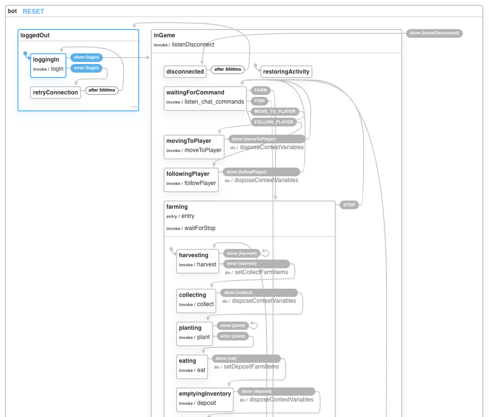

# iamCraftBot

> [Minecraft](https://www.minecraft.net) bot built on top of [mineflayer](https://github.com/PrismarineJS/mineflayer) powered by [XState](https://github.com/davidkpiano/xstate) state machine

[XState visualizer](https://xstate.js.org/viz/?gist=40a7ac4d26c0379b758f087ca234e8c5)

### Commands

* `/whisper [bot] come`
* `/whisper [bot] follow`
* `/whisper [bot] farm`
* `/whisper [bot] fish`
* `/whisper [bot] stop`
